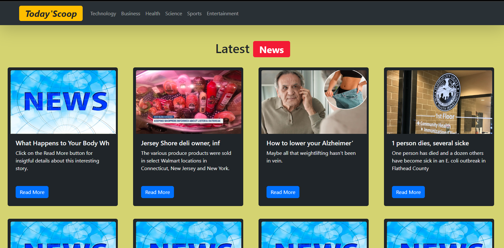

# React + Vite
web link -  https://today-scoop-magazine.web.app
Cannot be viewed from. The API is only for dev purposes

User can also view categories using the navbar for more relevant  headlines like Entertainment, Science, Technology etc..
.png)

This template provides a minimal setup to get React working in Vite with HMR and some ESLint rules.

Currently, two official plugins are available:

- [@vitejs/plugin-react](https://github.com/vitejs/vite-plugin-react/blob/main/packages/plugin-react/README.md) uses [Babel](https://babeljs.io/) for Fast Refresh
- [@vitejs/plugin-react-swc](https://github.com/vitejs/vite-plugin-react-swc) uses [SWC](https://swc.rs/) for Fast Refresh

web link -  https://today-scoop-magazine.web.app
